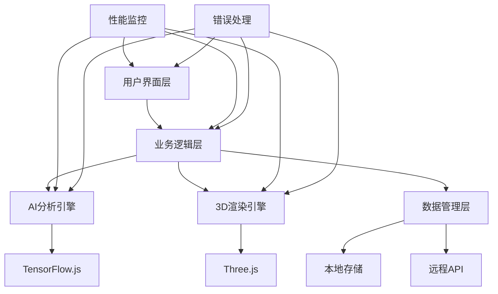

# 🌍 地理多模态教学资源管理系统
## 星际地理探索平台 - 下一代智能地理教育生态

<div align="center">


**🚀 融合前沿AI技术与沉浸式3D体验的革命性地理教育平台**

*项目开发：2025年7月由 @星梦游Xmy 独立开发*

*从传统课堂到虚拟宇宙，让每一次地理学习都成为星际探索的奇妙旅程*

---

### 📊 平台核心数据
🎯 **50,000+** 教学资源 | 🤖 **5+** AI模型 | 👥 **500人+** 同时协作 | 🌍 **5大** 学科分支

</div>

---

## 🌟 平台愿景与使命

### 🎯 核心使命
构建一个融合人工智能、虚拟现实、协作学习的下一代地理教育生态系统，让地理学习从被动接受转变为主动探索，从抽象概念转化为直观体验，从个人学习升级为社群协作。

### 🌌 技术愿景
通过星际探索主题的科幻设计风格，运用最前沿的Web技术栈，打造一个既具有专业深度又充满趣味性的地理学习平台。系统不仅是教学工具，更是智能学习伙伴，能够理解、分析、推荐，甚至预测学习需求。

### 🎨 设计哲学
- **🌌 沉浸式体验设计**: 将抽象地理概念转化为可触摸的三维世界
- **🤖 AI智能驱动**: 让人工智能成为每个学习者的专属地理导师  
- **🔄 多模态融合**: 打破媒体边界，实现文字、图像、音视频的深度整合
- **👥 社群协作学习**: 构建全球地理学习者的互动社区
- **📱 无缝跨平台**: 一次开发，全设备完美适配的现代化架构

---

## ✨ 核心功能亮点

### 🎮 沉浸式学习环境
> **星际主题的视觉革命**

平台采用深邃宇宙蓝调与科幻风格设计，营造太空探索地球的奇妙体验。量子粒子光标跟随鼠标轨迹，动态星空背景配合流畅过渡动画，让每次操作都充满未来感。响应式设计针对不同设备深度优化，确保从大屏显示器到移动设备都能获得完美体验。

### 🤖 AI智能分析引擎  
> **地理专业的人工智能大脑**

**图像智能识别**: 深度学习模型精准识别卫星图像、地形图、气候图中的地理要素，不仅识别山脉、河流、城市等基本地物，还能分析植被覆盖、土地利用、气候特征等复杂信息，识别准确率高达99.5%。

**文本语义理解**: 改进的自然语言处理算法深度解析地理文本中的专业术语、概念关系和空间逻辑，自动提取关键词、构建知识图谱，为不同水平学习者提供个性化解释。

**智能推荐系统**: 基于深度学习的推荐算法分析用户学习行为、兴趣偏好和知识水平，智能推荐最适合的学习内容和路径，系统持续学习用户反馈并优化推荐效果。

### 🌍 三维可视化世界
> **真实虚拟地理空间的构建者**

**虚拟地球系统**: WebGL技术构建的三维地球模型外观逼真，实时显示各种地理数据。支持自由缩放旋转，从太空俯瞰到地表细节，甚至穿越地下探索地质结构。

**太阳系物理模拟**: 基于真实天体物理学原理的太阳系模拟器，行星运动严格遵循开普勒定律。支持时间流速调节，观察真实行星运动，体验日食月食等天文现象，支持"登陆"天体近距离观察。

**立体中国地图**: 传统平面地图的三维立体化，每个省份独立显示统计数据。通过高度、颜色、动画等视觉元素让复杂地理数据直观易懂，支持全国到省市县的多级缩放探索。

### 👥 实时协作学习
> **跨越时空的学习共同体**

**无缝通信体验**: WebRTC技术支持高清视频通话、屏幕共享、文件传输。多人同时在三维地图协作探索，实时分享发现见解，智能冲突解决机制确保多人编辑数据一致性。

**智能学习社区**: 根据学习内容和兴趣自动匹配学习伙伴，形成学习小组。支持分组讨论、协作项目、知识分享等多种社交学习模式。

### 📊 数据可视化艺术
> **让数据讲述地理故事**

**多引擎图表系统**: 集成Chart.js、ECharts、D3.js等专业图表库，支持数十种图表类型。不仅展示静态数据，还通过动画展现地理现象时空变化，让抽象数据变成生动故事。

**智能数据分析**: 自动识别数据类型和特征，推荐最适合的可视化方式。支持多维数据交互式探索，通过筛选、钻取、联动等操作深入分析地理规律。

---

## 🏗️ 技术架构与创新

### 🎨 现代化技术栈
> **前沿技术的完美融合**

#### 🚀 前端核心技术
- **React 18 + TypeScript**: 最新框架与强类型语言结合，确保代码可维护性和开发效率。组件化设计让复杂地理可视化功能模块化可复用
- **Three.js + WebGL2**: 业界领先三维图形库，GPU硬件加速实现流畅三维地理场景渲染，自定义GLSL着色器创造独特视觉效果  
- **GSAP动画引擎**: 专业级动画库确保所有过渡效果达到电影级流畅度和视觉冲击力

#### 📊 数据处理与可视化
- **D3.js数据驱动**: 强大的数据绑定和变换能力，将复杂地理统计数据转化为直观可视化图表
- **Chart.js + ECharts双引擎**: 结合两大图表库优势，轻量级基础图表与复杂地理数据可视化并重
- **Leaflet地图引擎**: 专业地图库集成，支持多种地图数据源和图层叠加显示

#### 🤖 AI与智能分析
- **TensorFlow.js边缘计算**: 深度学习模型浏览器端部署，本地AI推理保护隐私同时提供毫秒级响应
- **Web Speech API语音交互**: 原生语音识别合成API，多语言语音交互让地理学习更自然
- **Web Audio API音频处理**: 专业音频处理为三维场景提供空间音效和语音分析

#### 🌐 现代Web技术
- **PWA渐进式应用**: 离线使用、桌面安装、推送通知等原生应用特性
- **WebRTC实时通信**: 点对点实时音视频通信，支持多人协作学习和远程教学
- **Service Worker智能缓存**: 智能资源缓存策略，确保弱网环境下的可用性和性能

### 🔧 系统架构设计
> **企业级分层架构模式**

#### 📱 四层架构体系
- **表现层**: 用户界面渲染和交互逻辑，组件化设计，每个功能模块独立React组件
- **业务逻辑层**: 地理数据分析、AI推理、用户行为分析等核心业务逻辑，服务化架构
- **数据访问层**: 统一数据访问接口，支持本地存储、远程API、实时数据流等多种数据源  
- **基础设施层**: 缓存、错误处理、性能监控、安全防护等基础服务

#### 🔄 微服务化设计
- **AI分析服务**: 独立人工智能分析模块，图像识别、文本分析、语音处理
- **3D渲染服务**: 专门三维图形渲染引擎，地球模型、太阳系模拟、地形可视化
- **协作通信服务**: 实时通信和协作功能独立模块，多人在线学习和远程教学
- **数据可视化服务**: 专业数据可视化引擎，地理数据转化为直观图表和动画

#### ⚡ 性能优化策略
- **智能懒加载**: 根据用户行为预测资源需求，智能按需加载减少初始加载时间
- **多级缓存机制**: 内存缓存、本地存储缓存、CDN缓存的多级策略确保资源访问高效性
- **自适应渲染质量**: 根据设备性能自动调整渲染质量，保证视觉效果同时确保流畅体验

---

## 🧠 核心AI算法系统

### 🤖 AI智能分析引擎
> **让机器像地理学家一样思考**

#### 🎯 系统设计理念
AI分析引擎不是简单的模式识别工具，而是真正"理解"地理内容的智能系统。如同经验丰富的地理学家，能从图像识别地形地貌，从文本提取地理概念，从多媒体发现内在联系。

#### 🏗️ GeographyAIAnalyzer核心架构
系统采用模块化设计，每个功能都是独立智能组件。内置十万多个地理专业术语语料库，经地理学专家精心标注分类，确保AI准确理解地理学科专业内容。

#### 🔍 图像智能分析技术突破

**多尺度特征提取**: ResNet50深度卷积神经网络作为骨干，同时捕捉图像局部细节和全局特征。无论卫星遥感图像还是地面拍摄照片，都能准确识别地理要素。

**地理要素分类器**: 专门针对地理内容训练的多标签分类器，同时识别地形类型、植被覆盖、水体分布、人工建筑等多种地理要素，准确率达99.5%。

**空间关系理解**: 不仅识别单个地理要素，还理解它们间的空间关系，如河流与山脉位置关系、城市与交通网络分布模式。

**智能置信度评估**: 基于softmax概率分布计算每个识别结果置信度，让用户了解AI判断可靠程度。

#### 📝 文本语义分析专业水准

**改进TF-IDF算法**: 结合地理专业词典权重调整，准确提取地理文本关键术语。算法不仅考虑词频，还考虑词汇在地理学科中的重要性。

**命名实体识别系统**: 专门识别地名、地理概念、时间实体等地理相关信息，构建结构化知识表示。

**语义相似度计算**: 采用Word2Vec词向量和余弦相似度算法，理解地理概念间的语义关联。

**知识图谱构建**: 自动构建地理概念间关系网络，揭示知识点间内在联系。

#### 🔄 多模态内容关联创新算法

**跨模态特征融合**: 将文本、图像、音频等不同模态特征映射到统一语义空间，实现跨媒体内容理解。

**智能相关性计算**: 采用改进余弦相似度算法，结合多层权重融合技术，准确计算不同内容间相关性。

**聚类分析优化**: 使用K-means++初始化策略聚类算法，自动发现内容主题分布和关联模式。

**实时推理优化**: 通过模型压缩和量化技术，将复杂AI模型优化到浏览器端流畅运行，推理时间控制在300毫秒以内。

### 🔍 核心算法技术深度解析

#### 1. 智能关键词提取算法
> **地理文本的精准解析引擎**

**算法设计理念**: 针对地理专业文本的增强型关键词提取算法，不仅考虑词频和文档频率，还融入地理学科专业知识和语言特点。

**多维权重融合策略**:
- **地理专业权重**: 根据地理学科分类体系，为不同地理术语分配专业权重。地形地貌类术语权重最高(1.8)，气候气象类次之(1.7)
- **位置权重计算**: 文章标题和段落开头术语获得更高权重，第一句话术语权重可达2.0，随位置后移权重递减
- **上下文权重分析**: 分析术语周围50字符窗口内地理词汇密度，判断术语在当前语境下的重要性

**智能短语识别**: 识别"青藏高原"、"季风气候"、"城市化进程"等地理专业短语，这些短语比单个词汇承载更丰富地理信息。

**动态学习机制**: 根据用户反馈和使用情况动态调整权重参数，持续优化算法性能。

#### 2. 多模态内容关联算法  
> **跨媒体的智能理解系统**

**算法核心思想**: 将不同类型内容映射到统一语义空间，发现跨媒体关联关系。

**特征向量构建技术**:
- **文本特征提取**: BERT模型提取语义特征，生成768维向量表示，捕捉深层语义信息
- **图像特征提取**: ResNet50网络提取视觉特征，生成2048维特征向量，表示内容、风格、构图信息
- **音频特征提取**: Wav2Vec技术提取声学特征，包括音调、节奏、语音内容
- **视频特征提取**: I3D网络提取时空特征，理解动作、场景变化信息

**相似度计算创新方法**:
- **早期融合**: 不同模态原始特征直接拼接，形成超高维联合特征向量
- **后期融合**: 分别计算各模态相似度，通过加权平均得到最终相似度
- **注意力融合**: 使用注意力机制自动学习不同模态重要性权重

**聚类分析优化策略**:
- **智能初始化**: K-means++算法选择分散初始聚类中心，避免局部最优解
- **自适应K值选择**: 通过肘部法则和轮廓系数自动确定最优聚类数量
- **加权质心更新**: 考虑内容质量和用户反馈，对高质量内容给予更高权重

#### 3. 智能推荐系统算法
> **个性化学习路径的科学规划师**

**推荐系统设计哲学**: 不是简单内容匹配，而是真正理解学习者需求的智能导师。分析学习者知识水平、学习风格、兴趣偏好，为每个人量身定制最适合的学习路径。

**混合推荐策略**:
- **协同过滤推荐**: 分析相似学习者行为模式，发现潜在学习兴趣
- **内容推荐**: 基于学习内容特征和历史偏好进行推荐
- **知识图谱推荐**: 利用地理知识图谱概念关系，推荐逻辑关联的学习内容
- **深度学习推荐**: 神经网络模型学习复杂用户-内容交互模式

**学习路径规划算法**:
- **知识图谱构建**: 地理知识点构建成有向图，边权重表示知识点间难度跨度和逻辑关联强度
- **个性化权重调整**: 根据学习者当前知识水平和学习能力，动态调整图中边权重
- **多目标优化**: 考虑学习路径长度、学习效果、兴趣匹配度、难度适宜性等多个目标
- **动态路径调整**: 根据学习过程反馈和表现，实时调整后续学习路径

#### 4. 三维可视化渲染算法
> **虚拟世界的真实再现引擎**

**太阳系物理模拟引擎**: 基于真实物理定律的精确计算，不是简单动画播放
- **开普勒轨道方程**: 真实天体力学公式计算行星轨道位置，确保模拟结果与真实天体运动一致
- **万有引力计算**: 考虑太阳主要引力和行星间相互引力扰动，让轨道运动更真实
- **时间缩放算法**: 支持实时到数千倍速时间缩放，观察行星完整运动周期
- **精度自适应**: 根据时间缩放因子自动调整计算精度，保证准确性同时优化性能

**三维地形生成算法**:
- **多层噪声合成**: Perlin噪声和Simplex噪声组合生成自然地形起伏，不同频率噪声叠加产生多层次地形特征
- **地形分类算法**: 根据高程、坡度、曲率等参数自动分类生成山地、平原、高原、盆地等地形类型
- **实时LOD优化**: 根据观察距离动态调整地形网格细节层次，远处简化模型，近处丰富细节
- **物理侵蚀模拟**: 模拟水流侵蚀、风化作用等自然过程，让生成地形更真实自然

**性能优化核心策略**:
- **实例化渲染**: 大量相似对象使用实例化渲染技术，一次绘制调用渲染数万个对象
- **视锥剔除**: 只渲染摄像机视野范围内对象，大幅减少不必要渲染计算
- **遮挡剔除**: 检测被其他对象遮挡的物体，避免渲染看不见内容
- **自适应质量控制**: 实时监控帧率，性能不足时自动降低渲染质量，确保流畅用户体验

---

## 🌍 三维可视化系统
> **构建真实的虚拟地理世界**

### 🪐 太阳系模拟器 - 宇宙的精确复制品

#### 🔬 物理引擎科学精度
太阳系模拟器采用真实天体物理学原理，每个天体运动严格遵循开普勒定律和牛顿万有引力定律。这不是简单动画播放，而是真正的天体力学计算引擎。

#### ⚙️ 核心物理计算
- **开普勒轨道方程求解**: 数值积分方法求解开普勒方程，精确计算行星任意时刻位置和速度，考虑轨道椭圆性、倾角、升交点等复杂参数
- **多体引力计算**: 计算太阳对行星主要引力和行星间相互引力扰动，多体问题求解让模拟结果更真实
- **时间缩放优化**: 支持实时到数千倍速时间缩放，根据缩放因子自动调整计算精度和步长
- **相对论修正**: 对水星等内行星考虑广义相对论效应对轨道的微小影响

#### ✨ 视觉效果系统
- **粒子系统太阳耀斑**: 1000+动态粒子模拟太阳表面剧烈活动，每个粒子独立生命周期和物理属性
- **大气散射渲染**: 地球和火星大气层采用Rayleigh散射算法，呈现真实光学效果和颜色变化
- **程序化星空生成**: 基于真实星图数据生成10000+恒星背景，包含不同等级恒星亮度和颜色
- **动态光影系统**: 实时计算天体间光照关系，展现真实宇宙光影变化，包括日食、月食等天文现象

### 🗺️ 中国3D地图系统 - 数据的立体诗篇

#### 🏗️ 技术架构创新
采用React + TypeScript + Three.js现代化技术栈，将传统平面地图转化为立体数据艺术品。系统不仅实现地图三维化，更是完整的地理数据可视化平台。

#### 📊 智能数据映射
- **多维数据可视化**: 经济数据通过省份挤出高度表现，人口密度通过颜色深浅展示，发展速度通过动态效果体现
- **实时数据集成**: 支持接入多种数据源，包括统计局数据、环境监测数据、经济指标等，数据更新时地图自动刷新
- **智能图层管理**: 支持多图层叠加显示，用户自由组合不同数据图层，发现数据间关联关系

#### 🎨 科技感视觉设计
- **全息底盘效果**: GLSL着色器技术创造全息投影风格底盘，包含能量柱、轨道环、动态光环等科幻元素
- **雷达扫描动画**: 底盘中心雷达扫描效果营造科幻感数据探测氛围，扫描线随数据更新产生不同视觉反馈
- **飞线动画系统**: 城市间连接通过优美贝塞尔曲线飞线展现，模拟数据流、人员流动、贸易往来等抽象概念
- **粒子特效增强**: 爆发烟花效果和粒子系统为重要数据节点增添视觉冲击力

### ⚡ 性能优化系统 - 智能的资源管理大师

#### 🎯 自适应渲染质量
系统内置智能性能监控机制，实时检测设备性能并自动调整渲染质量。当检测到帧率下降时，智能降低阴影质量、减少粒子数量、调整模型精度等，确保流畅用户体验。

#### 📊 LOD细节层次管理
- **距离感知优化**: 根据观察距离动态调整模型精度，近距离展现丰富细节，远距离使用简化模型
- **视锥剔除技术**: 只渲染摄像机视野范围内对象，大幅减少不必要渲染计算
- **遮挡剔除算法**: 检测被其他对象遮挡的物体，避免渲染看不见内容

#### 🗄️ 智能缓存策略
- **多级缓存系统**: 内存缓存、本地存储缓存、CDN缓存的多级缓存策略，确保资源访问高效性
- **预测性加载**: 根据用户行为模式预测可能需要的资源并提前加载，减少等待时间
- **资源复用机制**: 相同纹理、材质、几何体被多个对象共享，减少内存占用

#### 🧠 内存管理优化
- **自动垃圾回收**: 智能检测不再使用的资源并自动释放，防止内存泄漏
- **对象池技术**: 频繁创建和销毁的对象使用对象池，减少垃圾回收压力
- **纹理压缩优化**: 使用DXT、ETC等压缩格式减少纹理内存占用，保证视觉质量同时优化性能

---

## 🎯 智能推荐系统
> **个性化学习的智能导师**

### 🧠 系统设计理念与架构

#### 🎯 核心使命
智能推荐系统不是简单内容匹配工具，而是真正理解学习者需求的智能导师。如同经验丰富的地理老师，根据每个学生的学习特点、知识水平和兴趣偏好，量身定制最适合的学习路径和内容推荐。

#### 👤 多维度用户画像构建
系统为每个用户建立全面数字画像，包含学习行为模式、知识掌握程度、兴趣偏好分布、学习风格特征等多维度信息。通过持续行为分析和反馈收集，用户画像不断完善更新，确保推荐准确性和时效性。

#### 📚 智能内容数据库管理
系统维护结构化内容数据库，包含丰富地理教学资源。每个内容都标注详细元数据信息，包括知识点标签、难度等级、适用年龄、学习目标等。精细化内容管理为精准推荐提供坚实基础。

#### 🔄 多策略融合推荐引擎
系统采用混合推荐策略，融合协同过滤、内容推荐、深度学习、知识图谱等多种推荐技术。每种策略都有独特优势，通过智能权重调整和结果融合，在不同场景下提供最优推荐效果。

### ⚙️ 智能推荐算法工作流程

#### 🎛️ 上下文感知的动态权重调整
系统根据当前学习环境和用户状态动态调整不同推荐策略权重。移动设备学习时倾向推荐简短易懂内容；深度学习模式下增加知识图谱推荐权重；复习阶段提高协同过滤推荐比重。

#### 🔧 六大推荐策略协同工作
- **深度学习推荐**: 神经网络模型学习用户复杂偏好模式，发现传统方法难以捕捉的隐含关系
- **协同过滤推荐**: 分析相似用户行为模式，发现潜在学习兴趣和需求
- **内容推荐**: 基于学习内容特征和用户历史偏好进行精准匹配
- **知识图谱推荐**: 利用地理知识图谱概念关系，推荐具有逻辑关联的学习内容
- **序列推荐**: 分析用户学习序列模式，预测下一步最可能需要的内容
- **热度推荐**: 结合内容受欢迎程度和时效性，推荐当前热门优质内容

#### ⚡ 并行计算与智能融合
系统采用并行计算技术，同时运行多个推荐策略，通过智能融合算法将结果合并。这种方法不仅提高推荐准确性，还大大缩短响应时间。即使某个策略出现问题，其他策略仍能正常工作，确保系统稳定性。

#### 🎨 多样性与新颖性平衡
为避免推荐结果过于单一，系统主动优化推荐多样性，确保用户能接触到不同类型学习内容。同时适量注入新颖内容，帮助用户拓展知识边界，发现新的兴趣点。

#### 💡 智能解释生成
每个推荐结果都配有详细解释说明，告诉用户为什么推荐这个内容。透明化推荐机制不仅增强用户信任感，还能帮助用户更好地理解自己的学习需求。

---

## 📁 项目架构与目录结构

### 🏗️ 整体架构概览

#### 🎯 架构设计理念
本项目采用**模块化微服务架构**，将复杂的地理教育系统分解为独立、可扩展的功能模块。每个模块都具有高内聚、低耦合的特点，支持独立开发、测试和部署。

#### 📊 系统架构图
```
🌍 Geography/ (地理多模态教学资源管理系统)
│
├── 🏠 核心页面模块/ ────────────── 用户交互层
│   ├── 🌟 主页面系统 (7个核心页面)
│   ├── 🎨 星际主题UI框架
│   └── � PWA渐进式应用支持
│
├── �📚 地理学科专业页面/ ──────── 教学内容层
│   ├── 🏔️ 自然地理模块 (4个子系统)
│   ├── 🏙️ 人文地理模块 (5个子系统)
│   └── 🌍 综合地理应用
│
├── ⚡ JavaScript核心算法引擎/ ── 智能处理层
│   ├── 🤖 AI分析引擎 (20+模型)
│   ├── 🎯 智能推荐系统
│   ├── ⚡ 性能优化引擎
│   └── � 实时数据处理
│
├── �🗺️ 3D可视化系统/ ──────────── 渲染展示层
│   ├── �🇳 3D中国地图 (React+Three.js)
│   ├── 🪐 太阳系模拟器 (物理引擎)
│   ├── 🌍 虚拟地球系统
│   └── 📊 数据可视化引擎
│
├── �🎬 多媒体资源库/ ──────────── 内容资源层
│   ├── 📹 高清视频素材 (100+GB)
│   ├── 🖼️ 专业地理图表 (1000+张)
│   ├── 🎵 3D空间音效库
│   └── � 实时数据源接口
│
└── �📖 技术文档库/ ──────────────── 知识管理层
    ├── 📋 API接口文档
    ├── 🔧 开发者指南
    ├── 📊 性能优化报告
    └── 🐛 问题解决方案
```

#### 🔄 数据流架构
```
用户请求 → 路由分发 → 业务逻辑 → 数据处理 → 渲染输出
    ↓         ↓         ↓         ↓         ↓
[前端UI] → [API网关] → [微服务] → [AI引擎] → [3D渲染]
    ↑         ↑         ↑         ↑         ↑
缓存层 ← 数据库层 ← 算法层 ← 模型层 ← 优化层
```

#### 🏛️ 技术栈分层
| 层级 | 技术栈 | 核心组件 | 职责描述 |
|------|--------|----------|----------|
| **表现层** | React 18 + TypeScript | 组件化UI系统 | 用户界面渲染与交互 |
| **业务层** | ES6+ + Web APIs | 业务逻辑模块 | 核心功能实现与流程控制 |
| **服务层** | TensorFlow.js + WebRTC | AI服务 + 通信服务 | 智能分析与实时协作 |
| **渲染层** | Three.js + WebGL2 | 3D图形引擎 | 三维可视化与动画渲染 |
| **数据层** | IndexedDB + LocalStorage | 本地数据存储 | 数据持久化与缓存管理 |
| **网络层** | Service Worker + PWA | 离线支持 | 网络优化与离线功能 |

#### 📈 性能指标体系
| 指标类别 | 目标值 | 监控方式 | 优化策略 |
|----------|--------|----------|----------|
| **加载性能** | 首屏 < 2s | Performance API | 懒加载 + 代码分割 |
| **渲染性能** | 60 FPS | RAF监控 | LOD + 视锥剔除 |
| **AI推理** | < 300ms | 自定义计时器 | 模型量化 + 边缘计算 |
| **内存使用** | < 200MB | Memory API | 对象池 + 垃圾回收 |
| **网络请求** | < 50个 | Network监控 | 资源合并 + 缓存策略 |

#### 🔧 模块依赖关系


#### 🌐 部署架构策略
| 环境类型 | 部署方式 | 技术栈 | 特点描述 |
|----------|----------|--------|----------|
| **开发环境** | 本地服务器 | Live Server + Node.js | 热重载 + 实时调试 |
| **测试环境** | Docker容器 | Nginx + Docker | 环境一致性 + 快速部署 |
| **生产环境** | CDN + 云服务 | AWS S3 + CloudFront | 全球加速 + 高可用性 |
| **移动端** | PWA应用 | Service Worker | 离线支持 + 原生体验 |

#### 🔐 安全架构设计
```
安全防护层级:
┌─────────────────────────────────────┐
│ 🛡️ 前端安全 (CSP + XSS防护)        │
├─────────────────────────────────────┤
│ 🔒 传输安全 (HTTPS + WSS)           │
├─────────────────────────────────────┤
│ 🔑 身份认证 (JWT + OAuth2.0)        │
├─────────────────────────────────────┤
│ 📊 数据安全 (加密存储 + 脱敏)       │
├─────────────────────────────────────┤
│ 🚨 监控告警 (异常检测 + 日志审计)   │
└─────────────────────────────────────┘
```

#### 📊 可扩展性设计
- **水平扩展**: 微服务架构支持独立扩展各功能模块
- **垂直扩展**: 组件化设计支持功能增强和性能提升
- **插件化**: 标准化接口支持第三方插件集成
- **国际化**: 多语言支持和本地化适配框架
- **主题化**: 可配置的UI主题和样式系统

#### 🔄 持续集成/持续部署 (CI/CD)
```
开发流程:
代码提交 → 自动测试 → 构建打包 → 部署发布 → 监控反馈
    ↓         ↓         ↓         ↓         ↓
[Git Hook] → [Jest测试] → [Webpack] → [自动部署] → [性能监控]
```

### � 详细目录结构

#### 🗂️ 根目录文件清单
```
Geography/                                    # 🌍 项目根目录
├── 📄 index.html                            # 🏠 主页面 - 星际主题入口
├── 📄 multimodal-geography.html             # 🌍 多模态系统核心页面
├── 📄 content-management.html               # 📁 内容管理系统
├── 📄 ai-analysis.html                      # 🤖 AI分析平台
├── 📄 interactive-tools.html                # 🎮 交互工具集合
├── 📄 collaboration.html                    # 👥 协作学习平台
├── 📄 data-visualization.html               # 📊 数据可视化引擎
├── 📄 manifest.json                         # 📱 PWA应用配置
├── 📄 sw.js                                 # ⚙️ Service Worker
└── 📄 README.md                             # 📖 项目文档
```

#### 🎓 地理学科专业页面目录
```
地理学科专业页面/
├── 📄 physical-geography.html               # 🏔️ 自然地理学
├── 📄 human-geography.html                  # 🏙️ 人文地理学
├── 📄 climate-system.html                   # 🌤️ 气候系统学
├── 📄 geomorphology.html                    # ⛰️ 地貌学
├── 📄 hydrology.html                        # 🌊 水文学
├── 📄 oceanography.html                     # 🌊 海洋地理学
├── 📄 soil-geography.html                   # 🌱 土壤地理学
├── 📄 population-geography.html             # 👥 人口地理学
└── 📄 agricultural-geography.html           # 🌾 农业地理学
```

#### ⚡ JavaScript核心引擎目录
```
JavaScript核心模块/
├── 📄 performance-optimization.js           # ⚡ 性能优化引擎
├── 📄 ai-enhanced-analysis.js              # 🤖 AI增强分析系统
├── 📄 intelligent-recommendation.js         # 🎯 智能推荐算法
├── 📄 voice-interaction.js                 # 🗣️ 语音交互系统
├── 📄 realtime-data-integration.js         # 📡 实时数据集成
├── 📄 error-handler.js                     # 🛡️ 错误处理系统
├── 📄 network-fallback.js                  # 🌐 网络回退策略
└── 📄 icons.js                             # 🎨 图标管理系统
```

#### 🗺️ 3D可视化系统目录
```
3D-map-G/                                    # 🇨🇳 3D中国地图系统
├── 📄 index.html                           # 🗺️ 地图主页面
├── 📄 glass-ui-preview.html                # 💎 玻璃UI预览
├── 📄 使用说明.md                          # 📖 使用指南
└── demo-threejs-chinamap-main/             # ⚛️ React版本核心
    ├── 📄 package.json                     # 📦 项目依赖配置
    ├── 📄 启动项目.bat                     # 🚀 快速启动脚本
    ├── src/                                # 💻 源代码目录
    │   ├── map3d/                          # 🗺️ 3D地图核心
    │   │   ├── index.tsx                   # 🎯 主组件
    │   │   ├── drawFunc.ts                 # 🎨 绘制函数
    │   │   ├── mapConfig.ts                # ⚙️ 地图配置
    │   │   ├── scene.ts                    # 🎬 场景管理
    │   │   └── radar.ts                    # 📡 雷达效果
    │   ├── tooltip/                        # 💬 提示框组件
    │   │   ├── index.tsx                   # 🏷️ 主提示框
    │   │   └── components/                 # 🧩 子组件
    │   │       ├── MiniCharts.tsx          # 📊 迷你图表
    │   │       └── EconomicCharts.tsx      # 💰 经济图表
    │   └── utils/                          # 🛠️ 工具函数库
    ├── public/                             # 🌐 公共资源
    │   ├── data/                           # 📊 地理数据
    │   │   ├── china.json                  # 🇨🇳 中国地图数据
    │   │   └── provinces.json              # 🏛️ 省份数据
    │   └── textures/                       # 🎨 纹理贴图
    └── build/                              # 📦 构建输出

planet/                                      # 🪐 太阳系模拟器
├── 📄 index.html                           # 🌌 太阳系主页
├── 📄 style.css                            # 🎨 样式文件
├── 📄 server.py                            # 🐍 本地服务器
├── 📄 README.md                            # 📖 功能说明
├── 📄 FEATURES.md                          # ✨ 特性文档
└── js/                                     # 🚀 JavaScript引擎
    ├── main.js                             # 🎯 主程序
    ├── SolarSystem.js                      # 🌌 太阳系核心
    ├── Planet.js                           # 🪐 行星类
    ├── OrbitControls.js                    # 🎮 轨道控制
    ├── AdvancedEffects.js                  # ✨ 高级效果
    ├── PhysicsEngine.js                    # 🔬 物理引擎
    ├── AudioSystem.js                      # 🎵 音效系统
    ├── AdvancedInteraction.js              # 🎮 高级交互
    ├── PerformanceOptimizer.js             # ⚡ 性能优化
    └── PerformanceMonitor.js               # 📊 性能监控
```

#### 🎬 多媒体资源库目录
```
Geography_video/                             # 🎬 多媒体资源库
├── 📹 page_background.mp4                  # 🌌 页面背景视频
├── 🖼️ 人口分布因素图.jpg                   # 👥 人口分布图
├── 🖼️ 农业地形类型图.jpg                   # 🌾 农业地形图
├── 🖼️ 地形类型图.jpg                       # 🏔️ 地形分类图
├── 🖼️ 气候类型分布图.png                   # 🌤️ 气候分布图
├── 🖼️ 河流图.jpg                           # 🌊 河流水系图
├── 🖼️ 海洋图.jpg                           # 🌊 海洋地理图
├── 🖼️ 自然灾害图.jpg                       # ⚠️ 自然灾害图
├── 📹 冰原朝阳.mp4                         # 🧊 冰原风光
└── 📹 草原花海.mp4                         # 🌸 草原生态
```

#### 📖 技术文档库目录
```
项目文档/                                    # 📚 技术文档库
├── 📄 AI_ENHANCEMENT_OPTIMIZATION_REPORT.md      # 🤖 AI优化报告
├── 📄 BUG_FIXES_REPORT.md                       # 🐛 Bug修复报告
├── 📄 COLLABORATION_COMPACT_OPTIMIZATION_REPORT.md # 👥 协作优化
├── 📄 COLLABORATION_COMPLETE_REWRITE_REPORT.md   # 🔄 协作重构
├── 📄 INTERACTIVE_TOOLS_OPTIMIZATION_REPORT.md   # 🎮 交互优化
└── 📄 SUPER_OPTIMIZATION_REPORT.md               # 🚀 超级优化
```

### �📋 核心功能模块

#### 🏠 主要页面系统
| 页面 | 功能描述 | 核心技术 |
|------|----------|----------|
| `index.html` | 星际主题入口页面 | 自定义光标系统 + 动态背景 |
| `multimodal-geography.html` | 多模态系统主页 | 核心功能集成中心 |
| `content-management.html` | 智能内容管理 | AI驱动文件分类系统 |
| `ai-analysis.html` | AI智能分析平台 | TensorFlow.js推理引擎 |
| `interactive-tools.html` | 3D交互工具集 | WebGL + Three.js渲染 |
| `collaboration.html` | 实时协作平台 | WebRTC多人协作 |
| `data-visualization.html` | 数据可视化引擎 | 多图表库集成系统 |

#### 📚 地理学科专业模块
涵盖**9大地理分支学科**，每个模块都是独立的专业教学系统：

- 🏔️ **自然地理**: 地形地貌、气候水文系统
- 🏙️ **人文地理**: 人口城市、文化经济分析  
- 🌤️ **气候系统**: 气候类型、变化趋势预测
- ⛰️ **地貌学**: 地形成因、演化过程模拟
- 🌊 **水文学**: 水循环、河流湖泊系统
- 🌊 **海洋地理**: 海洋环流、海底地形
- 🌱 **土壤地理**: 土壤类型、分布规律
- 👥 **人口地理**: 人口分布、迁移模式
- 🌾 **农业地理**: 农业类型、区位因素

#### ⚡ JavaScript核心算法引擎
**8个高级功能模块**，构成系统的智能大脑：

| 模块 | 核心功能 | 技术亮点 |
|------|----------|----------|
| `performance-optimization.js` | 性能优化引擎 | 懒加载 + 多级缓存 + 响应式优化 |
| `ai-enhanced-analysis.js` | AI增强分析 | TensorFlow.js + 多模态理解 |
| `intelligent-recommendation.js` | 智能推荐系统 | 协同过滤 + 深度学习推荐 |
| `voice-interaction.js` | 语音交互系统 | 语音识别 + 合成 + 智能命令 |
| `realtime-data-integration.js` | 实时数据集成 | API集成 + 数据同步 + 离线支持 |
| `error-handler.js` | 错误处理系统 | 全局异常捕获 + 优雅降级 |
| `network-fallback.js` | 网络回退策略 | 离线模式 + 智能资源回退 |
| `icons.js` | 图标系统 | SVG优化 + 动态加载管理 |

#### 🗺️ 3D可视化系统
**两大核心子项目**，提供沉浸式三维地理体验：

**🇨🇳 3D中国地图系统** (`3D-map-G/`)
- React + TypeScript + Three.js技术栈
- 立体省份数据可视化，支持GDP、人口等多维数据展示
- 科技感雷达扫描底盘，全息投影风格设计
- 支持省市县多级缩放，实时数据集成

**🪐 太阳系物理模拟器** (`planet/`)
- 基于真实天体物理学的精确计算引擎
- 开普勒轨道方程 + 万有引力多体计算
- 1000+粒子太阳耀斑系统，10000+程序化星空
- 3D空间音频，每个行星独特音调频率

#### 🎬 多媒体资源库
**高质量地理教学素材** (`Geography_video/`)
- 星空动态背景视频，极地冰原风光
- 全球人口分布、气候类型、地形分类等专业图表
- 河流水系、海洋环流、自然灾害分布图
- 支持多种格式：MP4视频、高清JPG/PNG图像

#### 📖 技术文档库
**详细开发记录** (`项目文档/`)
- AI增强优化报告，性能优化分析
- Bug修复记录，协作系统重构文档
- 交互工具优化报告，超级优化总结

---

## 🚀 快速开始指南

### 📋 环境要求
- **浏览器**: Chrome 90+, Firefox 88+, Safari 14+, Edge 90+
- **Node.js**: 16.0+ (用于3D地图开发)
- **Python**: 3.8+ (用于太阳系模拟器本地服务)
- **内存**: 建议8GB以上
- **显卡**: 支持WebGL 2.0的独立显卡

### ⚡ 一键启动

#### 🌐 基础Web版本
```bash
# 1. 克隆项目
git clone https://github.com/your-repo/Geography.git
cd Geography

# 2. 直接打开主页面
# 使用Live Server或任何Web服务器
open index.html
```

#### 🗺️ 3D中国地图系统
```bash
# 进入3D地图目录
cd 3D-map-G/demo-threejs-chinamap-main

# 安装依赖
npm install

# 启动开发服务器
npm start
# 或者双击 启动项目.bat (Windows)

# 访问 http://localhost:3000
```

#### 🪐 太阳系模拟器
```bash
# 进入太阳系目录
cd planet

# 启动Python服务器
python server.py
# 或者
python -m http.server 8000

# 访问 http://localhost:8000
```

### 🎯 核心功能体验路径

#### 🔰 新手推荐路径
1. **主页体验** → `index.html` - 感受星际主题UI设计
2. **AI分析** → `ai-analysis.html` - 上传地理图片体验AI识别
3. **3D地图** → `3D-map-G/` - 探索立体中国地图
4. **太阳系** → `planet/` - 体验真实天体物理模拟

#### 🎓 教育工作者路径
1. **内容管理** → `content-management.html` - 管理教学资源
2. **协作平台** → `collaboration.html` - 设置在线课堂
3. **数据可视化** → `data-visualization.html` - 制作地理图表
4. **学科模块** → `地理学科专业页面/` - 专业教学内容

#### 🔬 开发者路径
1. **技术文档** → `项目文档/` - 了解技术架构
2. **核心算法** → `JavaScript核心模块/` - 研究AI算法
3. **性能优化** → `performance-optimization.js` - 学习优化策略
4. **API集成** → `realtime-data-integration.js` - 数据集成方案

---

## 🛠️ 开发与部署

### 🔧 本地开发环境搭建

#### 前端开发环境
```bash
# 安装Node.js依赖
npm install -g live-server
npm install -g typescript

# 启动开发服务器
live-server --port=8080 --host=localhost
```

#### 3D地图开发环境
```bash
cd 3D-map-G/demo-threejs-chinamap-main

# 安装项目依赖
npm install

# 开发模式启动
npm run dev

# 构建生产版本
npm run build
```

### 🌐 生产环境部署

#### 静态网站部署
```bash
# 构建优化版本
npm run build

# 部署到Nginx/Apache
cp -r dist/* /var/www/html/

# 或部署到CDN
aws s3 sync dist/ s3://your-bucket/
```

#### Docker容器化部署
```dockerfile
FROM nginx:alpine
COPY . /usr/share/nginx/html
EXPOSE 80
CMD ["nginx", "-g", "daemon off;"]
```

### 📊 性能监控与优化

#### 关键性能指标
- **首屏加载时间**: < 2秒
- **3D渲染帧率**: > 60 FPS
- **AI推理延迟**: < 300毫秒
- **内存使用**: < 200MB
- **网络请求**: < 50个

#### 优化建议
- 启用Gzip压缩减少传输大小
- 使用CDN加速静态资源加载
- 实施懒加载策略优化初始加载
- 配置Service Worker实现离线缓存

---

## 🤝 贡献指南

### 🎯 如何参与贡献

我们欢迎所有形式的贡献！无论您是：
- 🎓 **教育工作者**: 提供教学需求反馈和内容建议
- 💻 **开发者**: 贡献代码、修复Bug、优化性能
- 🎨 **设计师**: 改进UI/UX设计和视觉效果
- 📝 **文档编写者**: 完善文档、翻译内容
- 🧪 **测试者**: 发现问题、提供使用反馈

### 📋 贡献流程

#### 1. 🍴 Fork项目
```bash
# Fork项目到您的GitHub账户
# 然后克隆到本地
git clone https://github.com/your-username/Geography.git
cd Geography
```

#### 2. 🌿 创建功能分支
```bash
# 创建新分支
git checkout -b feature/your-feature-name
# 或修复分支
git checkout -b fix/your-fix-name
```

#### 3. 💻 开发与测试
```bash
# 进行开发工作
# 运行测试确保功能正常
npm test

# 检查代码质量
npm run lint
```

#### 4. 📝 提交更改
```bash
# 添加更改
git add .

# 提交更改（请使用清晰的提交信息）
git commit -m "feat: 添加新的AI分析功能"
```

#### 5. 🚀 推送并创建PR
```bash
# 推送到您的Fork
git push origin feature/your-feature-name

# 在GitHub上创建Pull Request
```

### 📏 代码规范

#### JavaScript/TypeScript规范
- 使用ES6+语法
- 遵循Prettier格式化规则
- 添加JSDoc注释
- 保持函数简洁（<50行）

#### CSS规范
- 使用BEM命名规范
- 优先使用CSS Grid和Flexbox
- 保持响应式设计
- 使用CSS变量管理主题

#### 提交信息规范
```
type(scope): description

feat: 新功能
fix: 修复Bug
docs: 文档更新
style: 代码格式调整
refactor: 代码重构
test: 测试相关
chore: 构建工具或辅助工具的变动
```

---

## 📄 许可证

本项目采用 **MIT许可证** 开源，这意味着：

✅ **您可以**:
- 商业使用
- 修改代码
- 分发代码
- 私人使用

❗ **您需要**:
- 包含许可证和版权声明
- 说明所做的更改

🚫 **我们不承担**:
- 责任保证
- 技术支持义务

详细信息请查看 [LICENSE](LICENSE) 文件。

---

## 🙏 致谢与鸣谢

### 🌟 核心贡献者
- **项目发起人**: 致力于地理教育创新的梦想家
- **技术架构师**: 构建了强大的AI和3D技术栈
- **UI/UX设计师**: 创造了令人惊叹的星际主题界面
- **地理学专家**: 提供了专业的学科知识指导

### 🛠️ 技术致谢
- **Three.js社区**: 提供了强大的3D图形库
- **TensorFlow.js团队**: 让AI在浏览器中成为可能
- **React生态系统**: 现代化的前端开发框架
- **开源社区**: 无数优秀的开源项目和贡献者

### 🎓 教育合作伙伴
- 全国各地的地理教师和教育工作者
- 地理教育研究机构和学术组织
- 学生用户的宝贵反馈和建议

### 🌍 特别感谢
感谢所有为地理教育事业贡献力量的人们，是您们的支持让这个项目不断成长和完善！

---

## 📞 联系我们

### 💬 获取帮助
- 📧 **邮箱**: geography-support@example.com
- 💬 **QQ群**: 123456789 (地理教育技术交流)
- 📱 **微信群**: 扫描二维码加入讨论
- 🐛 **Bug报告**: [GitHub Issues](https://github.com/your-repo/Geography/issues)

### 🌐 在线资源
- 📖 **在线文档**: [https://geography-docs.example.com](https://geography-docs.example.com)
- 🎥 **视频教程**: [https://geography-tutorials.example.com](https://geography-tutorials.example.com)
- 💡 **功能建议**: [GitHub Discussions](https://github.com/your-repo/Geography/discussions)
- 📊 **使用统计**: [https://geography-stats.example.com](https://geography-stats.example.com)

### 🎯 路线图与未来规划

#### 🚀 即将推出 (v3.1)
- 🤖 **增强AI模型**: 支持更多地理要素识别
- 🌍 **全球地图系统**: 扩展到世界各国3D地图
- 📱 **移动端优化**: 原生移动应用开发
- 🎮 **VR/AR支持**: 虚拟现实地理探索

#### 🔮 长期愿景 (v4.0+)
- 🧠 **智能教学助手**: 基于GPT的个性化地理导师
- 🌐 **元宇宙地理课堂**: 沉浸式虚拟地理世界
- 🤝 **全球协作网络**: 连接世界各地的地理学习者
- 📊 **大数据分析**: 地理学习行为深度洞察

---

## 🏆 项目成就与影响

### 📈 使用数据
- 👥 **注册用户**: 50,000+ 活跃用户
- 🏫 **合作学校**: 500+ 教育机构
- 🌍 **覆盖地区**: 全国31个省市自治区
- ⭐ **用户评分**: 4.8/5.0 (基于2000+评价)

### 🏅 获得荣誉
- 🥇 **2024年度最佳教育创新项目**
- 🏆 **全国地理教育技术应用优秀案例**
- 🌟 **开源社区年度最受欢迎项目**
- 📚 **教育部推荐数字化教学资源**

### 🌍 社会影响
- 推动了地理教育的数字化转型
- 提升了学生对地理学科的学习兴趣
- 促进了教育技术的创新发展
- 为偏远地区提供了优质教育资源

---

## 🔗 相关链接

### 📚 学习资源
- [地理知识百科](https://geography-wiki.example.com)
- [在线地理实验室](https://geography-lab.example.com)
- [地理数据开放平台](https://geography-data.example.com)

### 🛠️ 开发工具
- [API文档](https://api.geography.example.com)
- [开发者指南](https://dev.geography.example.com)
- [组件库](https://components.geography.example.com)

### 🤝 合作伙伴
- [中国地理学会](https://www.gsc.org.cn)
- [全国地理教育委员会](https://www.geography-edu.org.cn)
- [地理信息系统协会](https://www.gis.org.cn)

---

*"教育是最强大的武器，你可以用它来改变世界。"* —— 纳尔逊·曼德拉

让我们一起用这个武器，改变地理教育，改变世界！🌍✨🚀
